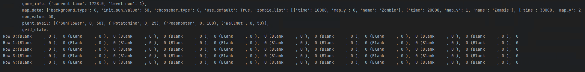

# PythonPlantsVsZombies with AI

Game part fork from [PythonPlantsVsZombies](https://github.com/marblexu/PythonPlantsVsZombies)

Reference: https://hanadyg.github.io/portfolio/report/INF581_report.pdf


## Intro
- 四种植物: 豌豆射手、向日葵、樱桃炸弹、坚果墙, 无尽模式, 僵尸随机出现, 且僵尸只有血量和行动速度区别, 僵尸出现数量和频率随时间增大
- state ( 每个格子上的植物、每个格子上的僵尸血量总和、可用植物状态、阳光数 )
- 测试指标: 存活时间 ( state 中有个 current_time )

- 运行游戏 `python main.py --level 1 --agent_type random --game_speed 1.0`  
  - level 为选择关卡
  - 游戏运行时按下任意键可以打印当前状态


## 游戏部分
```
├── state
│   ├── levle.py     # 游戏界面
│   ├── mainmenu.py  # 开始界面
│   ├── screen.py    # 结束界面
│    ...
├── tool.py          # controler
```

## AI Agent
```
├── agents
│   ├── env.py       # 环境状态, 游戏更新相关, 包括 GameState 和 GameRunner (重载levle, Control)
│   ├── agent.py     # 智能体实现 ( manual, random, logic, DQN )
│   ├── 
│    ...

```
