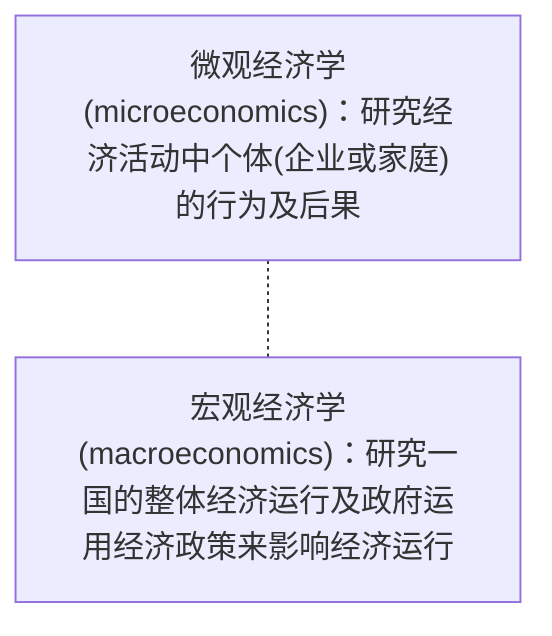

# 宏观经济学介绍

### \#宏观经济学和微观经济学的区别

### #经济学研究的问题

# 宏观经济学的数据

### Chapter 23 一国收入的衡量

#### 23.1 衡量标准

##### 23.1.1 经济的收入和支出

- 经济中所有人赚到的总收入——GDP
- 对一个（没有贸易的）整体经济而言，收入必定等于支出，因为： 
  -  每一次交易都有买者和卖者。
  - 某个买者的1美元支出就是某个卖者的1美元收入

##### 23.1.2 其他收入指标

#### 23.2 GDP

##### 23.2.1 概念

- 国内生产总值(GDP) 是在某一既定时期一个国家内生产的所有最终物品与劳务的市场价值。

- **未进入市场的产品** 和 **非法生产和销售的** 不包括在GDP中

- 
  

##### 23.2.2 GDP 的组成部分

$$
Y = C + I + G +NX
$$

$Y$ : GDP

$Consumption(C)$: 消费   #<u>除购买新住房外的用于物品和劳务的支出</u>

$Investment(I)$: 投资（在未来生产商品和服务，金融投资不是经济学意义上的投资）   #<u>==房子属于投资品==，存货</u>

$Government\ Purchases(G)$: 政府购买

$Net\ Exports(NX)$: 净出口   #<u>从美国购买金项链不改变 GDP，消费增加和净出口减少抵消</u>

- e.g. 答案D.      #<u>C购买劳动力所以属于 GDP，D转移支付不属于</u>

  

##### 23.2.3 真实GDP、名义GDP 和 GDP平减指数 (GDP deflator) 

#### 23.3 GDP 是个好指标吗？

- GDP 指标的不足 limitations

### Chapter 24 生活费用的衡量

#### 24.1 通货膨胀(inflation) 和 消费物价指数 (consumer price index CPI)

##### 24.1.1  概念

##### 24.1.2 计算方式

##### 24.1.3 CPI 的问题

1. **替代倾向**（<u>高估</u>生活费用增加）

2. **新产品的引进**（篮子没有考虑新的产品  <u>高估</u>生活费用增加）

3. **无法衡量的质量变动**（<u>高估</u>）

##### 24.1.4 GDP平减指数 和 CPI 的关系

#### 24.2 实际利率和名义利率

##### 24.2.1 概念

- 名义利率(nominal interest rates) 是没有根据通货膨胀校正的利率：它是银行所支付的利率

- 实际利率(real interest rates) 是根据通货膨胀校正的利率

##### 24.2.2 实际利率
- **实际利率 = 名义利率 – 通货膨胀率**

# 长期中的真实经济

### Chapter 25 生产与增长

#### 25.1 生产率（productivity）

##### 25.1.1 概念

- 每单位劳动投入所生产的物品和劳务的数量 人均GDP

  生产率 $= Y \div L$ 

  $Y =$ 真实 GDP = 生产劳务和物品的数量

  $L = $ 劳动数量

##### 25.1.2 决定生产率的因素

- 
- 
- 
- 

#### 25.2 生产函数

##### 25.2.1 概念

- 用生产函数来描绘生产中投入和产出的关系

$$
Y = A \times F(L, K, H, N)
$$

$A$ – 技术水平，$A$乘以$F( )$，因此技术进步（ $A$的增加）会使经济可以用既定的投入组合生产出更多产量（$Y$）

##### 25.2.2 推论

# 长期中的货币与物价

### Chapter 29 货币制度

#### 29.1 货币的含义和职能

##### 29.1.1 概念

- 货币（money）：经济中人们经常用于向他人购买物品与服务的一组资产 ≠ 财富（财富包括货币和非货币资产）

##### 29.1.2 货币的职能

- **交换媒介**：买者在购买物品与劳务时给予卖者的东西
- **计价单位**：人们用来表示价格和记录债务的标准
- **价值储藏手段**：人们可以用来把现在的购买力转变为未来的购买力的东西（除了货币，____也有这个功能? 流动性 vs.  价值储藏功能的权衡取舍）
- ==货币流动性强，储藏手段弱==

##### 29.1.3 货币供给（money supply）

- 货币供给（或货币存量）：经济中流通的货币量

#### 29.2 银行与货币供给

##### 29.2.1 准备金制度

- 没有银行
  

- 完全准备金
  

- 部分准备金

  

#### 29.3 货币乘数

e.g. 

#### 29.3 控制货币供给的三种工具

##### 29.3.1 公开市场操作：买卖政府债务/国债

##### 29.3.2 法定准备金：影响银行通过放贷创造的货币量

##### 29.3.3 贴现率：美联储向银行发放贷款的利率

- “最后贷款人”，~~印钞机印出来的~~
- 一般在出现危机时

#### 29.4 联邦基金利率

##### 29.4.1 概念

 

##### 29.4.2 货币政策与联邦基金利率

### Chapter 30 货币增长与通货膨胀

#### 30.1 货币数量论

#### 30.2 货币供给与货币需求

##### 30.2.1 货币需求

##### 30.2.2 货币需求

**\# 由B点到A点的微观解释**

##### 30.2.3 货币中性论

